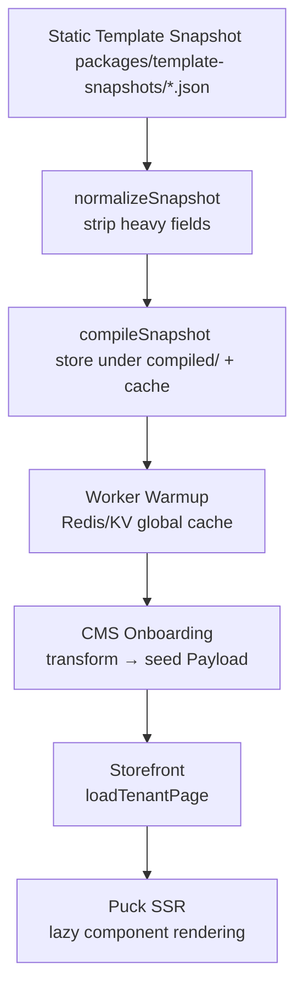

# 🎯 **README.md — Multitenant SaaS Commerce Platform**

# Multitenant Commerce Platform

**Next.js 15 + PayloadCMS + Puck + Redis/KV + Workers + PNPM Monorepo**

This repository contains a **fully modular multi‑tenant SaaS storefront engine**, powered by a visual page builder (Puck), template snapshots, a dynamic runtime storefront, a CMS backend, and background workers for caching and CDN tasks.

The entire architecture is optimized for:

* **Multi‑tenant SSR at scale**
    
* **Runtime template merging**
    
* **Lazy component loading**
    
* **Canonical versioned templates**
    
* **Fast cold starts**
    
* **Automatic template compilation + caching**
    
* **Full CI/CD automation with GitHub Actions**
    

* * *

# 🧱 Architecture Overview

```
                 ┌───────────────────────────┐
                 │        Payload CMS        │
                 │  Tenant onboarding        │
                 │  Snapshot loader          │
                 │  Template transformer     │
                 │  Page/Product storage     │
                 └───────────────┬───────────┘
                                 │
                    Seeded tenant data (Pages, Products)
                                 │
         ┌───────────────────────▼────────────────────────┐
         │                Background Worker                │
         │ Warm template cache (Redis/KV)                 │
         │ Product cache regeneration                     │
         │ CDN purge                                       │
         └───────────────────────┬────────────────────────┘
                                 │
                   Cached template/page content
                                 │
              ┌──────────────────▼──────────────────┐
              │            Storefront (Next.js)      │
              │ Multi‑tenant runtime (SSR)           │
              │ Lazy-loaded components               │
              │ Puck snapshot renderer               │
              └──────────────────────────────────────┘
```

* * *

# 📦 Monorepo Structure

```
/
├── apps/
│   ├── cms/                  # PayloadCMS app (admin + onboarding)
│   ├── storefront/           # Next.js 15 storefront runtime
│   └── worker/               # Background worker (cache + CDN)
│
├── packages/
│   ├── ui-components/        # Shared UI components with lazy & eager maps
│   ├── template-snapshots/   # Static versioned master template snapshots
│   └── shared-utils/         # Optional shared utility helpers
│
├── infra/
│   ├── github-actions/       # Deployment workflows (CMS, Storefront, Worker)
│   ├── docker/               # Docker build configs
│   └── cdn/                  # CDN setup & docs
│
├── pnpm-workspace.yaml
└── package.json
```

* * *

# 🎨 Shared UI Components (packages/ui-components)

All storefront + CMS preview UI lives in the **shared package**.

## Lazy Component Map (Storefront runtime)

```ts
export const lazyComponentMap = {
  Hero: () => import("./Hero"),
  ProductGrid: () => import("./ProductGrid"),
  Section: () => import("./Section"),
  Callout: () => import("./Callout"),
  Footer: () => import("./Footer"),
  Page: () => import("./Page"),
};
```

✔ Loads only needed components  
✔ Fast SSR + small bundle  
✔ Perfect for serverless / edge

## Eager Component Map (Puck Editor in CMS)

```ts
import Hero from "./Hero";
import ProductGrid from "./ProductGrid";

export const eagerComponentMap = {
  Hero,
  ProductGrid,
  Section,
  Callout,
  Footer,
  Page,
};
```

✔ Instant preview  
✔ Zero flicker  
✔ Works inside Payload Admin UI

* * *

# 📄 Static Template Snapshots

Located in:

```
/packages/template-snapshots/
```

These files are the **canonical template definitions** used for:

* Tenant onboarding
    
* Worker warmup
    
* Storefront runtime
    
* Versioned template development
    

Example:

```
modern.json
minimal.json
fashion.json
electronics.json
```

* * *

# 🔁 Template Snapshot Lifecycle

All templates follow this strict process:



This ensures:

* Consistent templates
    
* Fast runtime
    
* Zero duplication
    
* Deterministic builds
    

* * *

# 🏗 CMS App (PayloadCMS)

Responsibilities:

* **Tenant onboarding**
    
* **Template selection**
    
* **Template snapshot loading**
    
* **Transforming compiled snapshots → Payload docs**
    
* **Seeding tenant pages, products, settings**
    
* **Admin UI**
    
* **Puck Editor (using eager components)**
    

Key Features:

* `/endpoints/onboarding/createTenant.ts`
    
* `/endpoints/templates/snapshot.ts`
    
* `/utils/normalizeSnapshot.ts`
    
* `/utils/transformCompiledToPayload.ts`
    
* `/utils/seedTenantFromTemplate.ts`
    

* * *

# 🌐 Storefront App (Next.js 15)

Responsibilities:

* Multi-tenant runtime (detect domain → load tenant)
    
* SSR Puck snapshot renderer
    
* `loadTenantPage()` resolver
    
* Lazy component loading via `lazyComponentMap`
    
* Template merging:
    
    * Template snapshot
        
    * Tenant overrides
        
    * Dynamic data (products)
        
* Multi-layer caching:
    
    * Memory LRU
        
    * Redis/KV
        
    * Next.js ISR
        

Key Files:

```
/storefront/src/
  lib/tenant/loadTenantPage.ts
  lib/templates/load-template-snapshot.ts
  lib/puck/PuckRenderer.server.tsx
  lib/puck/safeDeserialize.ts
  lib/puck/mergeEngine.ts
  app/[...slug]/page.tsx
```

* * *

# ⚙️ Worker App

Responsibilities:

* Warm template caches (Redis/KV)
    
* Compile templates (normalize → compress → store)
    
* Regenerate product caches
    
* Purge CDN
    
* Revalidate storefront pages
    

Key Files:

```
worker/
  tasks/template-snapshot-cache.ts
  tasks/product-cache.ts
  tasks/cdn-purge.ts
  clients/redis.ts
  clients/payload.ts
  clients/cdn.ts
```

* * *

# 🔧 Development

### Install dependencies

```bash
pnpm install
```

### Run all apps

```bash
pnpm dev
```

### Build all apps + packages

```bash
pnpm build
```

* * *

# 🚀 Deployment (GitHub Actions)

Found under:

```
/infra/github-actions/
```

Includes:

* `deploy-cms.yml`
    
* `deploy-storefront.yml`
    
* `deploy-worker.yml`
    

* * *

# 🧪 Testing

### Unit Tests (Vitest)

* Snapshot loader
    
* Transformer
    
* Tenant loader
    
* Merge engine
    

### Integration Tests (MSW)

* Full tenant page resolution
    
* Mocked Payload
    
* Mocked Redis
    
* Worker warmup flow
    

* * *

# 🎯 Summary

This repository is a **complete multi‑tenant commerce engine** built with:

* Next.js 15
    
* PayloadCMS
    
* Puck Editor
    
* Redis/KV caching
    
* Background workers
    
* Shared UI component package
    
* Versioned template snapshots
    
* Fully automated deployments
    
* Multi-layer rendering pipeline
    
* pnpm monorepo architecture
    

It is optimized for performance, scalability, maintainability, and template-driven tenant deployment.
